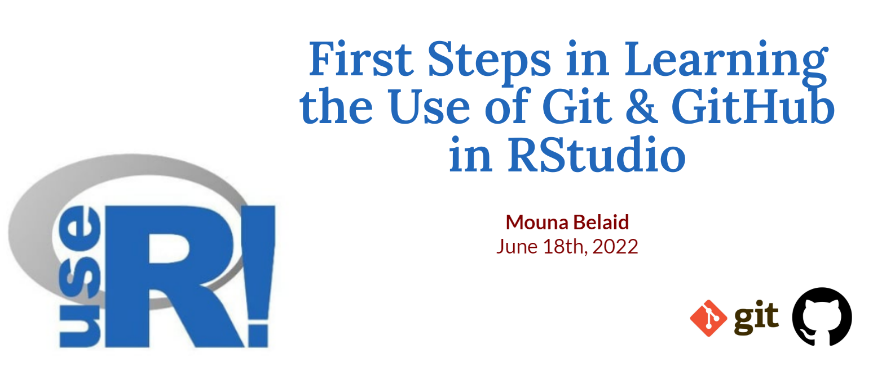

Workshop created for the [the useR! 2022 Conference](https://user2022.r-project.org/)

# Workshop site: [mounabelaid.github.io/First-Steps-in-Learning-the-Use-of-Git-and-GitHub-in-RStudio-useR2022/](https://mounabelaid.github.io/First-Steps-in-Learning-the-Use-of-Git-and-GitHub-in-RStudio-useR2022/)
